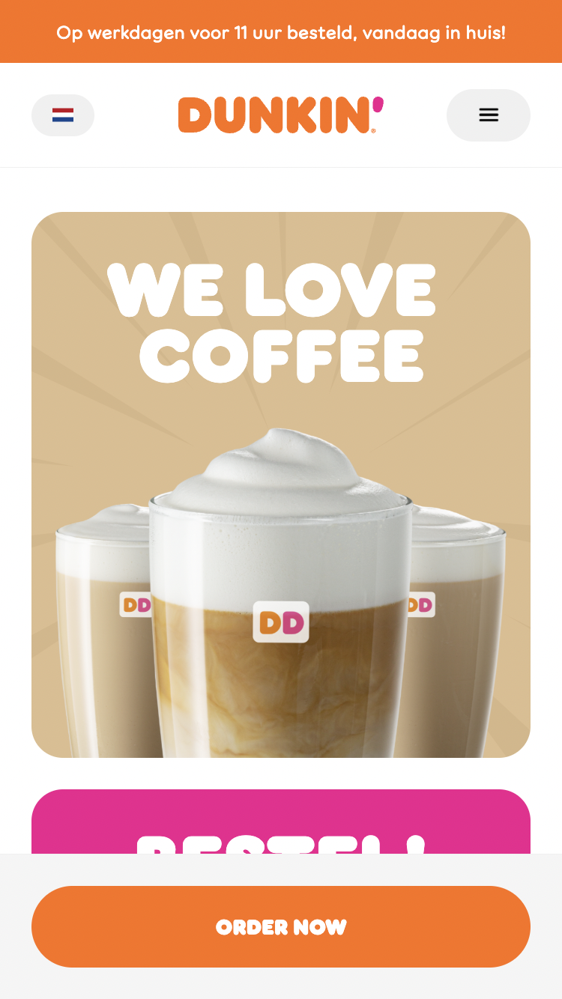
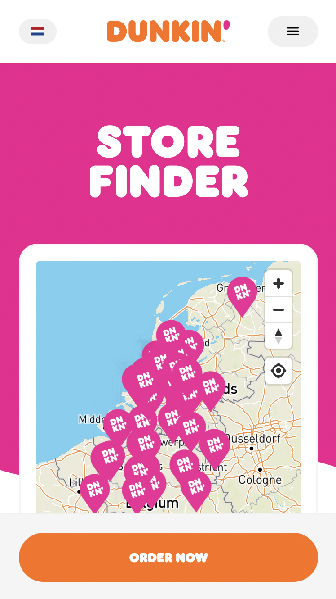
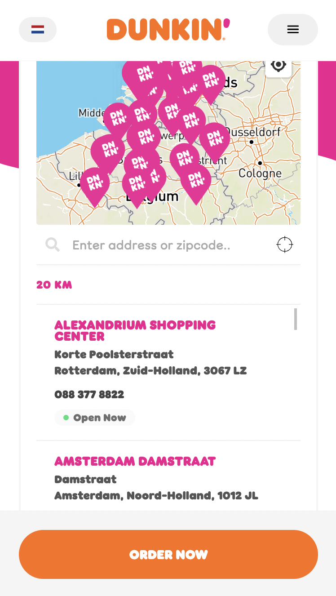
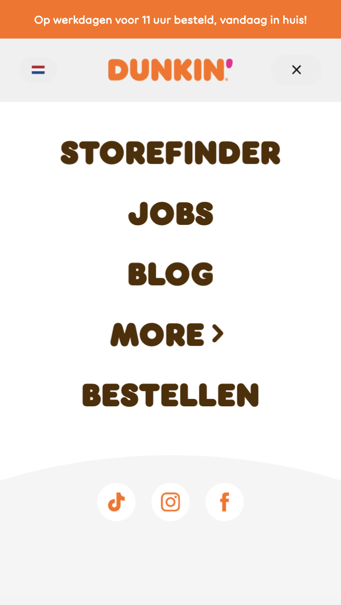

# Procesverslag
Markdown is een simpele manier om HTML te schrijven.  
Markdown cheat cheet: [Hulp bij het schrijven van Markdown](https://github.com/adam-p/markdown-here/wiki/Markdown-Cheatsheet).

Nb. De standaardstructuur en de spartaanse opmaak van de README.md zijn helemaal prima. Het gaat om de inhoud van je procesverslag. Besteedt de tijd voor pracht en praal aan je website.

Nb. Door *open* toe te voegen aan een *details* element kun je deze standaard open zetten. Fijn om dat steeds voor de relevante stuk(ken) te doen.

## Jij

  
uitwerken voor kick-off werkgroep

  ### Auteur:
  Samya El Ghazi 

  #### Je startniveau:
  Voor nu kies ik blauw.

  #### Je focus:
  Mijn focus ligt op responsiveness van de website. (kies uit responsive óf surface plane)
 

## Je website

  
uitwerken voor kick-off werkgroep

  ### Je opdracht:
  link naar de website die je gaat namaken óf de naam/omschrijving van je eigen ontwerp:
  https://www.dunkin.nl/

  #### Screenshot(s) van de eerste pagina (small screen): 
  hier de naam van de pagina  
  

  #### Screenshot(s) van de tweede pagina (small screen):
  hier de naam van de pagina  
  
  
 

## Toegankelijkheidstest 1/2 (week 1)

  
uitwerken na test in 1e werkgroep

  ### Bevindingen
  Lijst met je bevindingen die in de test naar voren kwamen:
  bevinding 1: de focus is best duidelijk weergegeven op de site.
  bevinding 2: bij het tabben is het bij het lijstje met de pijltjes alleen onduidelijk omdat het steeds doorgaat. Het duurt best lang voordat je bij de volgende item terecht komt onder het lijstje.

  #### Screenreader
  Hier korte omschrijving (met indien nodig afbeeldingen):

  omschrijving: De screenreader leest niet alles in de juiste volgorde omdat er veel divs zijn gebruikt in de website. Bij het kopje bestellen word er gevraagd om je postcode in te voeren maar dit word niet voorgelezen door de screenreader. Hij zegt alleen "je bevindt je momenteel op een tekstveld. Typ om tekst in dit veld in te voeren.

  Er is ook een lijst met laatste nieuws over dunkin (ze komen bijvoorbeeld naar tiel) maar de screenreader blijft dit meerdere keren herhalen en gaat niet verder naar het volgende kopje.
  

  Problemen kunnen opgelost worden door bijvoorbeeld sections en articles te gebruiken.

  #### Muis en Toetsenbord 
  Er is een focus state en hover met animatie aanwezig voor de muis en toetsenbord, dus dit is wel duidelijk. Alleen bij het tabben moet het op sommige stukken logisch worden opgesteld. (met indien nodig afbeeldingen)

  Sections en articles in de html van links naar rechts opstellen zodat dit logisch voorgelezen kan worden door de screenreader. (met indien nodig afbeeldingen)

  #### Motoriek (shocks, elastiekjes)
  Met een apparaat op mn arm heb ik kunnen testen hoe het was om als een persoon met motoriek problemen op een website te surfen. Bij dunkin was het wel te doen omdat niet alle knoppen veel te dicht bij elkaar staan, alleen bij de navigatie en op het pijltje om naar rechts te klikken voor het volgende nieuws ging het iets moeilijker.

  De knop met het pijltje groter maken, nu is hij een stukje kleiner. De navigatie kan misschien ook wat meer uit elkaar gezet worden. (met indien nodig afbeeldingen)

  #### Visueel (brillen, contrast, kleurenblind, dark/light). 
  Over het algemeen is er wel nagedacht over mensen met een visuele beperking op de site van dunkin. Alleen was het bij de bril die zwarte vlekken heeft aan de zijkant iets moeilijker om dingen te zien die rechts aan de pagina stonden. Ook was het voor de bril met zwarte vlek in het midden moeilijk om locaties te vinden op de kaart bij de storefinder page.

  Over het algemeen was het goed te doen op de site. Alleen de storefinder page met de pinpoint locaties waren moeilijk te zien dus hier zou verandering in kunnen komen. (met indien nodig afbeeldingen)

## Breakdownschets (week 1)

  
uitwerken na afloop 2e werkgroep

  ### de hele pagina: 
  

  ### dynamisch deel (bijv menu): 
  

  ### wellicht nog een dynamisch deel (bijv filter): 
  

## Voortgang 1 (week 2)

  
uitwerken voor 1e voortgang

  ### Stand van zaken
  Tot nu toe heb ik alleen een heel klein deel van de HTML opgesteld en nog niks van de styling. ik heb alleen de navigatie in een flexbox gezet maar dit heeft allemaal nog veel aanpassing nodig. Hetzelfde geldt voor het logo en deze moet dan ook klikbaar worden in het font van dunkin. Ik oefen nog met de opdrachten van flexbox, grid en de positionering. Zodra ik hiervan meer weet toe te passen op de opdracht dan ga ik zo verder.

  ### Agenda voor meeting
  samen met je groepje opstellen

  | student 1      | student 2          | student 3    | student 4        |
  | ---            | ---                | ---          | ---              |
  | dit bespreken  | en dit             | en ik dit    | en dan ik dat    |
  | en dat ook nog | dit als er tijd is | nog een punt | dit wil ik zeker |
  | ...            | ...                | ...          | ...              |

  Student 1: Samya
  - ik wil graag bespreken hoe ik tekst kan krijgen op de plaatjes van dunkin, en waar ik het font kan downloaden.

  ### Verslag van meeting
  hier na afloop snel de uitkomsten van de meeting vastleggen

  - punt 1
  - punt 2
  - nog een punt
  - ...

## Voortgang 2 (week 3)

  
uitwerken voor 2e voortgang

  ### Stand van zaken
  hier dit ging goed & dit was lastig (neem ook screenshots op van delen van je website en code)

  ### Agenda voor meeting
  samen met je groepje opstellen

  | student 1      | student 2          | student 3    | student 4        |
  | ---            | ---                | ---          | ---              |
  | dit bespreken  | en dit             | en ik dit    | en dan ik dat    |
  | en dat ook nog | dit als er tijd is | nog een punt | dit wil ik zeker |
  | ...            | ...                | ...          | ...              |

  ### Verslag van meeting
  hier na afloop snel de uitkomsten van de meeting vastleggen

  - punt 1
  - punt 2
  - nog een punt
- ...

## Toegankelijkheidstest 2/2 (week 4)

  
uitwerken na test in 8e werkgroep

  ### Bevindingen
  Lijst met je bevindingen die in de test naar voren kwamen (geef ook aan wat er verbeterd is):

  #### Screenreader
  Hier korte omschrijving (met indien nodig afbeeldingen)

  Hier een omschrijving van hoe het opgelost kan worden (met indien nodig afbeeldingen)

  #### Muis en Toetsenbord 
  Hier korte omschrijving (met indien nodig afbeeldingen)

  Hier een omschrijving van hoe het opgelost kan worden (met indien nodig afbeeldingen)

  #### Motoriek (shocks, elastiekjes)
  Hier korte omschrijving (met indien nodig afbeeldingen)

  Hier een omschrijving van hoe het opgelost kan worden (met indien nodig afbeeldingen)

  #### Visueel (brillen, contrast, kleurenblind, dark/light). 
  Hier korte omschrijving (met indien nodig afbeeldingen)

  Hier een omschrijving van hoe het opgelost kan worden (met indien nodig afbeeldingen)

## Voortgang 3 (week 4)

  
uitwerken voor 3e voortgang

  ### Stand van zaken
  hier dit ging goed & dit was lastig (neem ook screenshots op van delen van je website en code)

  ### Agenda voor meeting
  samen met je groepje opstellen

  | student 1      | student 2          | student 3    | student 4        |
  | ---            | ---                | ---          | ---              |
  | dit bespreken  | en dit             | en ik dit    | en dan ik dat    |
  | en dat ook nog | dit als er tijd is | nog een punt | dit wil ik zeker |
  | ...            | ...                | ...          | ...              |

  ### Verslag van meeting
  hier na afloop snel de uitkomsten van de meeting vastleggen

  - punt 1
  - punt 2
  - nog een punt
  - ...

## Eindgesprek (week 5)

  
uitwerken voor eindgesprek

  ### Je uitkomst - karakteristiek screenshots:
  

  ### Dit ging goed/Heb ik geleerd: 
  Korte omschrijving met plaatjes

  

  ### Dit was lastig/Is niet gelukt:
  Korte omschrijving met plaatjes

  

## Bronnenlijst

  
continu bijhouden terwijl je werkt

  Nb. Wees specifiek ('css-tricks' als bron is bijv. niet specifiek genoeg).

  1. bron 1
  2. bron 2
  3. ...

